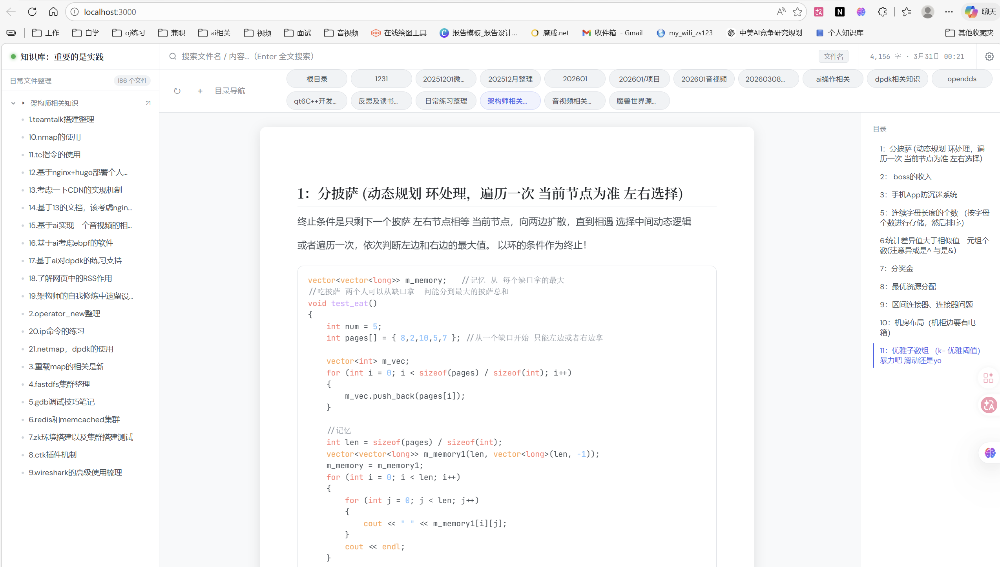

# 📚 知识库本地查看器

零依赖的本地 Markdown 知识库展示工具。

## 描述
自己的第一个vibe coding产品，目标是作为自己知识沉淀的载体，把自己的学习经验进行落实。
通过项目实践，落实自己使用ai的能力，提升自己的实践力。

### 展示效果




## 目录结构

```
kb-viewer/
├── server.js      ← 服务端（Node.js，无需任何 npm 安装）
├── public/
│   └── index.html ← 前端界面
├── notes/         ← 你的 Markdown 文件放在这里（首次运行自动创建）
└── README.md
```

## 快速启动

### 方法一：使用启动脚本（推荐）

```bash
# 1. 进入项目目录
cd kb-viewer

# 2. 运行启动脚本
# Windows:
start.bat

# Linux/macOS:
chmod +x start.sh
./start.sh

# 3. 脚本会自动打开浏览器访问 http://localhost:3000
```

启动脚本支持以下选项：
```bash
./start.sh --dir ./my-notes --port 8080
./start.sh -h  # 查看帮助
```

### 方法二：直接使用 Node.js

```bash
# 1. 进入项目目录
cd kb-viewer

# 2. 启动服务（Node.js 版本 >= 14 即可，无需 npm install）
node server.js

# 3. 打开浏览器
# 访问 http://localhost:3000
```

## 自定义目录和端口

```bash
# 指定知识库目录
node server.js C:\Users\yun68\Desktop\日常文件整理 

# 指定目录和端口
node server.js D:/我的笔记 8080

# Windows 示例
node server.js C:\Users\你的名字\Documents\Notes 3000
```

## 功能说明

| 功能 | 说明 |
|------|------|
| 目录分组 | 按文件夹自动分组，支持任意层级嵌套 |
| Markdown 渲染 | 标题、表格、引用块、代码、图片全支持 |
| 代码高亮 | 100+ 语言自动识别，一键复制 |
| 文件名搜索 | 侧边栏实时过滤文件名 |
| 全文搜索 | 输入关键词后按 **Enter** 搜索所有文件内容 |
| 暗色主题 | 默认暗色，护眼适合长时间阅读 |

## 搜索使用方法

- **文件名搜索**：在搜索框输入文字，实时过滤左侧文件列表
- **全文搜索**：输入关键词后按 `Enter`，搜索所有文件内容并显示上下文片段

## 推荐目录结构

```
notes/
├── 技术笔记/
│   ├── Python 基础.md
│   ├── Git 命令速查.md
│   └── Docker 入门.md
├── 读书摘要/
│   ├── 深度工作.md
│   └── 原则.md
├── 农业/
│   ├── 苹果种植技术.md
│   └── 土壤改良方案.md
└── 日记/
    └── 2025-06.md
```

## 常见问题

**Q: 提示「无法连接服务」？**
A: 确认 `node server.js` 已在终端运行，且没有报错。

**Q: 文件修改后不更新？**
A: 刷新浏览器（F5）即可，服务每次请求都实时读取文件。

**Q: 支持中文文件名吗？**
A: 完全支持。

**Q: 要不要一直开着终端？**
A: 是的，关闭终端即停止服务。可以最小化放在后台运行。

